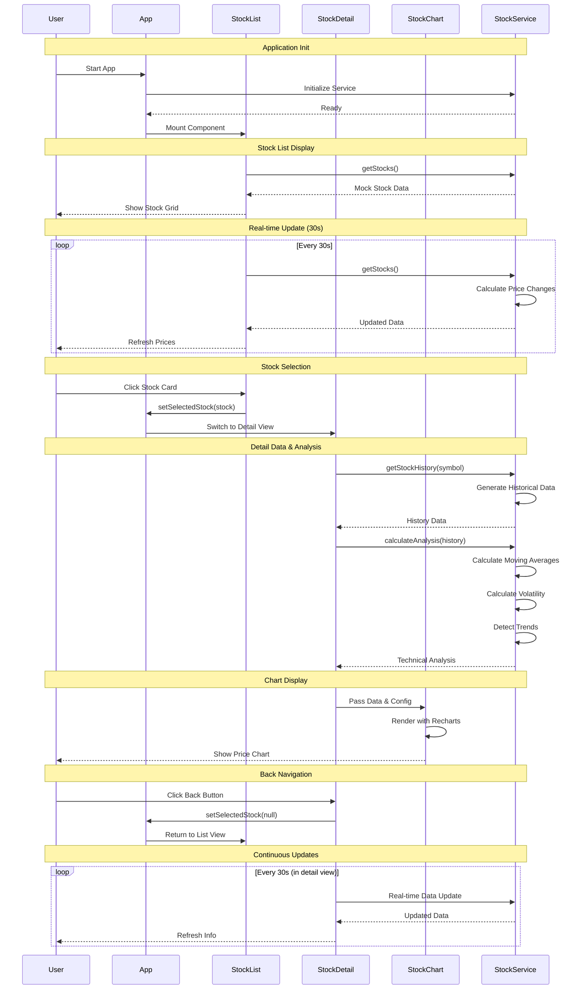

# 株価分析アプリケーション処理シーケンス図

## 主要な処理フロー

1. **初期化フェーズ**: アプリケーション起動とStockServiceの初期化
2. **データ取得フェーズ**: モック株価データの取得と表示
3. **リアルタイム更新**: 30秒間隔での自動データ更新
4. **株式選択**: ユーザーインタラクションによる詳細画面遷移
5. **詳細分析**: 履歴データ取得とテクニカル分析計算
6. **チャート描画**: Rechartsを使用した視覚化
7. **ナビゲーション**: 条件付きレンダリングによる画面切り替え

## 技術的特徴

- **モック戦略**: 数学関数（サイン波、ランダム変動）による現実的な株価シミュレーション
- **クライアント側計算**: すべてのテクニカル分析はブラウザ内で実行
- **状態管理**: App.tsxでの`selectedStock`による単純な状態制御
- **非同期処理**: `setTimeout`によるネットワーク遅延シミュレーション